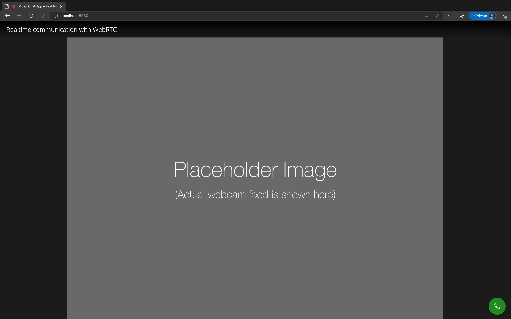

# Realtime communication with WebRTC

A simple demo app created by following the Codelab [Real time communication with WebRTC](https://codelabs.developers.google.com/codelabs/webrtc-web).

This is the early preview that only works iin local mode. Will be adding more to it to make it an actual video chat app.

### Preview of the Current UI

## Contributing

I'm not accepting any active contributions to this project since this is just a project created while following a tutorial.

I will open it for contributions once I've made some additional modifications.

## License

This project is licensed under [MIT License](LICENSE).
